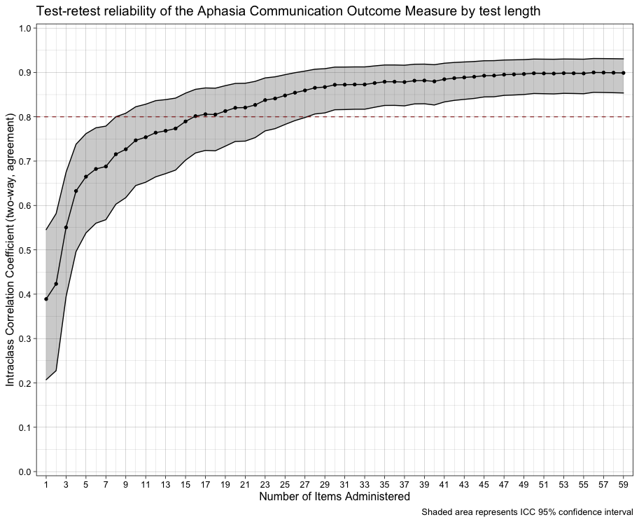

**Considerations for Selecting ACOM Test Length**

- ACOM users may select any test length between 12 and 59 items, and items will be administered adaptively, based on the responses provided. 

- Administering all 59 items takes between 15 and 30 minutes for most persons with aphasia (median = 21) and administering 12 items takes between 5 and 10 minutes (median = 8.5).

- Administering all 59 available items provides the most reliable score estimates, but as shown in the plot below, tests lengths of 40 items or greater provide similarly high reliability, and scores from test lengths between 30 and 40 are only slightly less reliable.

- Test lengths of at least 26 items are required to obtain reliability of at least 0.80 with 95% confidence.

- Although our initial work on the ACOM suggested that 12 items provided usefully precise score estimates, more recent data collected from a larger sample of participants with aphasia by a larger number of clinicians suggests that 12 items provide unacceptably low reliability, with test-retest reliability coefficients below 0.80.

- Reliability is of greatest concern when attempting to interpret change scores derived from multiple longitudinal administrations to a single person with aphasia. For users who desire only a rough estimate of self-reported communicative effectiveness at a single point in time, or who are seeking to analyze scores aggregated across groups of persons with aphasia, shorter test lengths with correspondingly lower reliability may suffice.

The figure below shows estimated test-retest reliability as a function of test length. The data were obtained from a sample of 101 persons with aphasia of a at least six months post-onset. These participants were given the ACOM twice over the span of approximately two weeks with no intervening aphasia treatment. On both occasions, participants were given all 59 ACOM items, with the first 12 administered adaptively and the remaining items given in random order, with an additional 40 candidate items randomly interspersed in most cases. These additional candidate items were not included in any of the score estimates. The test-retest reliability estimates shown in the plot below were obtained by post-hoc simulation of adaptive administration of all test lengths between 12 and 59, inclusive. For each test length, test-retest reliability was estimated using the two-way absolute agreement intraclass correlation coefficient model. 

